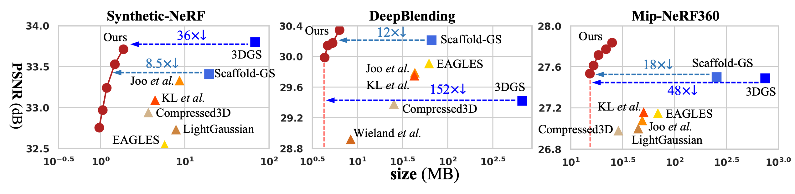

# [ECCV'24] HAC
Official Pytorch implementation of **HAC: Hash-grid Assisted Context for 3D Gaussian Splatting Compression**.

[Yihang Chen](https://yihangchen-ee.github.io), 
[Qianyi Wu](https://qianyiwu.github.io), 
[Jianfei Cai](http://jianfei-cai.github.io), 
[Mehrtash Harandi](https://sites.google.com/site/mehrtashharandi/),
[Weiyao Lin](https://weiyaolin.github.io)

[[`Arxiv`](https://arxiv.org/abs/2403.14530)] [[`Project Page`](https://yihangchen-ee.github.io/project_hac/)] [[`Github`](https://github.com/YihangChen-ee/HAC)]

## Links
🎉 [CNC](https://github.com/yihangchen-ee/cnc/) [CVPR'24] is now released for efficient NeRF compression! [[`Paper`](https://openaccess.thecvf.com/content/CVPR2024/papers/Chen_How_Far_Can_We_Compress_Instant-NGP-Based_NeRF_CVPR_2024_paper.pdf)] [[`Project Page`](https://yihangchen-ee.github.io/project_cnc/)] [[`Github`](https://github.com/YihangChen-ee/CNC)]

## Overview
<p align="left">

</p>

Our approach introduces a binary hash grid to establish continuous spatial consistencies, 
allowing us to unveil the inherent spatial relations of anchors through a carefully designed context model. 
To facilitate entropy coding, we utilize Gaussian distributions to accurately estimate the probability of each quantized attribute, 
where an adaptive quantization module is proposed to enable high-precision quantization of these attributes for improved fidelity restoration.
 Additionally, we incorporate an adaptive masking strategy to eliminate invalid Gaussians and anchors. 
Importantly, our work is the pioneer to explore context-based compression for 3DGS representation, resulting in a remarkable size reduction.

## Performance
<p align="left">

</p>


## Installation

We tested our code on a server with Ubuntu 20.04.1, cuda 11.8, gcc 9.4.0
1. Unzip files
```
cd submodules
unzip diff-gaussian-rasterization.zip
unzip gridencoder.zip
unzip simple-knn.zip
cd ..
```
2. Install environment
```
conda env create --file environment.yml
conda activate HAC_env
```

## Data

First, create a ```data/``` folder inside the project path by 
```
mkdir data
```

The data structure will be organised as follows:

```
data/
├── dataset_name
│   ├── scene1/
│   │   ├── images
│   │   │   ├── IMG_0.jpg
│   │   │   ├── IMG_1.jpg
│   │   │   ├── ...
│   │   ├── sparse/
│   │       └──0/
│   ├── scene2/
│   │   ├── images
│   │   │   ├── IMG_0.jpg
│   │   │   ├── IMG_1.jpg
│   │   │   ├── ...
│   │   ├── sparse/
│   │       └──0/
...
```

 - For instance: `./data/blending/drjohnson/`
 - For instance: `./data/bungeenerf/amsterdam/`
 - For instance: `./data/mipnerf360/bicycle/`
 - For instance: `./data/nerf_synthetic/chair/`
 - For instance: `./data/tandt/train/`


### Public Data (We follow suggestions from [Scaffold-GS](https://github.com/city-super/Scaffold-GS))

 - The **BungeeNeRF** dataset is available in [Google Drive](https://drive.google.com/file/d/1nBLcf9Jrr6sdxKa1Hbd47IArQQ_X8lww/view?usp=sharing)/[百度网盘[提取码:4whv]](https://pan.baidu.com/s/1AUYUJojhhICSKO2JrmOnCA). 
 - The **MipNeRF360** scenes are provided by the paper author [here](https://jonbarron.info/mipnerf360/). And we test on its entire 9 scenes ```bicycle, bonsai, counter, garden, kitchen, room, stump, flowers, treehill```. 
 - The SfM datasets for **Tanks&Temples** and **Deep Blending** are hosted by 3D-Gaussian-Splatting [here](https://repo-sam.inria.fr/fungraph/3d-gaussian-splatting/datasets/input/tandt_db.zip). Download and uncompress them into the ```data/``` folder.

### Custom Data

For custom data, you should process the image sequences with [Colmap](https://colmap.github.io/) to obtain the SfM points and camera poses. Then, place the results into ```data/``` folder.

## Training

To train scenes, we provide the following training scripts: 
 - Tanks&Temples: ```run_shell_tnt.py```
 - MipNeRF360: ```run_shell_mip360.py```
 - BungeeNeRF: ```run_shell_bungee.py```
 - Deep Blending: ```run_shell_db.py```
 - Nerf Synthetic: ```run_shell_blender.py```

 run them with 
 ```
 python run_shell_xxx.py
 ```

The code will automatically run the entire process of: **training, encoding, decoding, testing**.
 - Training log will be recorded in `output.log` of the output directory. Results of **detailed fidelity, detailed size, detailed time** will all be recorded
 - Encoded bitstreams will be stored in `./bitstreams` of the output directory.
 - Evaluated output images will be saved in `./test/ours_30000/renders` of the output directory.
 - Optionally, you can change `lmbda` in these `run_shell_xxx.py` scripts to try variable bitrate.
 - **After training, the original model `point_cloud.ply` is losslessly compressed as `./bitstreams`. You should refer to `./bitstreams` to get the final model size, but not `point_cloud.ply`. You can even delete `point_cloud.ply` if you like :).**


## Contact

- Yihang Chen: yhchen.ee@sjtu.edu.cn

## Citation

If you find our work helpful, please consider citing:

```bibtex
@inproceedings{hac2024,
  title={HAC: Hash-grid Assisted Context for 3D Gaussian Splatting Compression},
  author={Chen, Yihang and Wu, Qianyi and Cai, Jianfei and Harandi, Mehrtash and Lin, Weiyao},
  booktitle={European Conference on Computer Vision},
  year={2024}
}
```


## LICENSE

Please follow the LICENSE of [3D-GS](https://github.com/graphdeco-inria/gaussian-splatting).

## Acknowledgement

 - We thank all authors from [3D-GS](https://github.com/graphdeco-inria/gaussian-splatting) for presenting such an excellent work.
 - We thank all authors from [Scaffold-GS](https://github.com/city-super/Scaffold-GS) for presenting such an excellent work.
